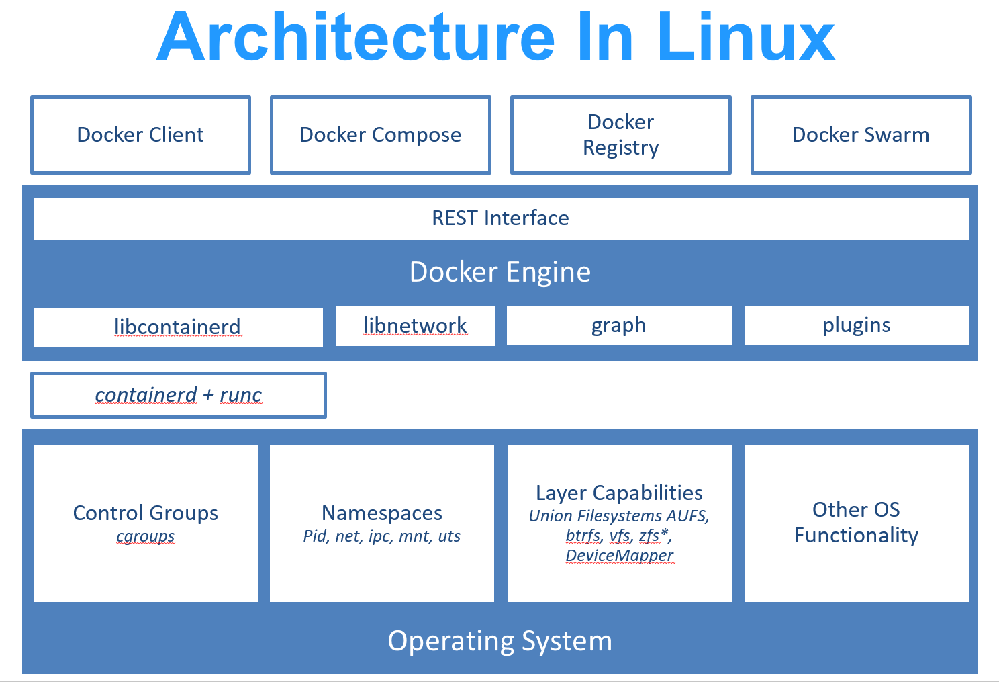
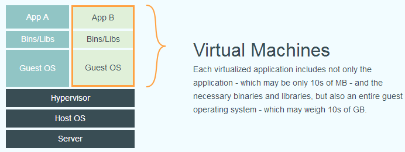
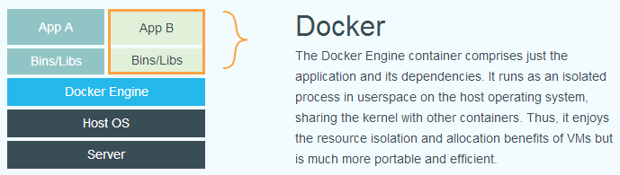

# 什么是Docker
Docker是一种容器式的虚拟化技术，让你可以在容易中开发、测试，缩短产品上线周期。

Docker 在容器的基础上，进行了进一步的封装，从文件系统、网络互联到进程隔离等等，极大的简化了容器的创建和维护,使得 Docker 技术比虚拟机技术更为轻便、快捷。下面两张图比较Docker和传统虚拟机的区别。

# 几个基本概念
* 镜像(Image)
   Docker镜像是一种特殊的文件系统，类似于Linux系统的root文件系统一样，它为容器运行提供所需的程序、库、资源等文件，还包含一些配置参数。
* 容器(Container)
   镜像和容器的关系，就像是面向对象程序设计中的类和实例 一样，镜像是静态的定义，容器是镜像运行时的实体。容器可以被创建、启动、停止、删除、暂停等。
   容器的实质是进程，但与直接在宿主执行的进程不同，容器进程运行于属于自己的独立的 命名空间。因此容器可以拥有自己的root文件系统、自己的网络配置、自己的进程空间，甚至自己的用户ID空间。容器内的进程是运行在一个隔离的环境里，这种特性使得容器封装的应用比直接在宿主运行更加安全。
* 仓库(Registry)
  镜像构建完成后，可以很容易的在当前宿主机上运行，但是，如果需要在其它服务器上使用这个镜像，我们就需要一个集中的存储、分发镜像的服务，仓库就提供这样的服务。
